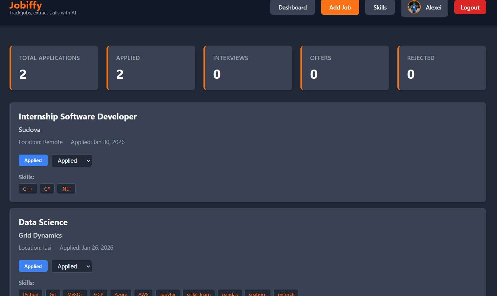
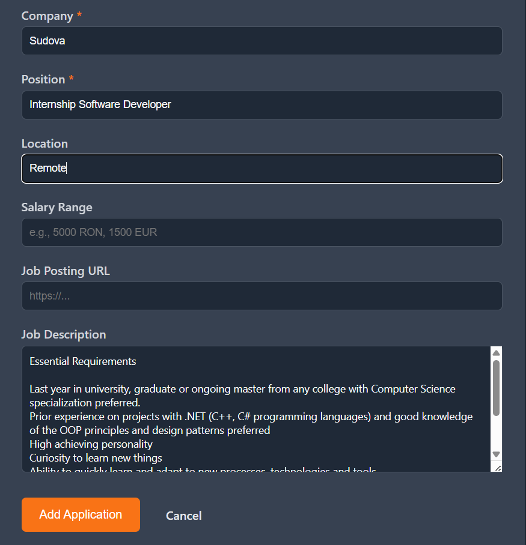
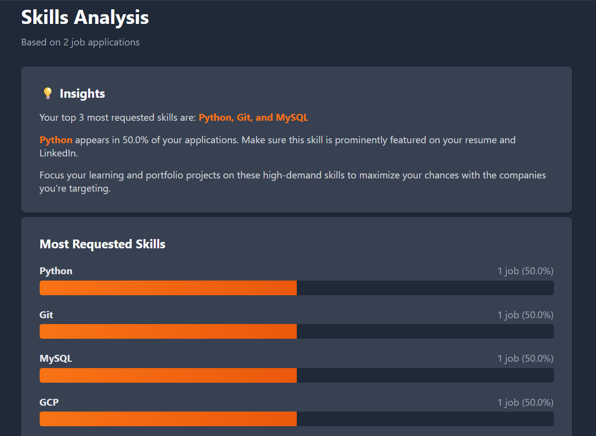

# Jobiffy - Job Application Tracker

> Because spreadsheets are so 2010.

Track your job applications without losing your sanity. Built with Flask, powered by AI, and deployed so you can actually share it with people.


## Live Demo

[Check it out here](https://job-tracker-beryl-nine.vercel.app) - Sign in with Google and start tracking!

## What It Does

- **Track applications**: Company, position, salary, location, status - all in one place
- **AI skill extraction**: Paste a job description, let AI figure out what skills they want
- **Skills dashboard**: See which skills pop up most in your applications
- **Google Auth**: Because nobody wants to manage another password
- **Actually looks decent**: Dark mode UI that won't hurt your eyes

## Tech Stack

**Backend:**
- Flask
- SQLAlchemy
- PostgreSQL
- Authlib (Google OAuth)

**Frontend:**
- HTML/CSS
- Dark theme

**AI:**
- Groq API (for skill extraction)

**Deployment:**
- Vercel (hosting)
- Supabase (database)

## Screenshots

### Dashboard

*Track all your applications with status updates*

### Add Job with AI

*Paste a job description and let AI extract the required skills*

### Skills Dashboard

*See which skills appear most frequently in your target jobs*

## Running Locally

### Prerequisites
- Python 3.10+
- A Supabase account (or just use SQLite locally)
- Google OAuth credentials
- Groq API key

### Setup

1. **Clone the repo**
```bash
git clone https://github.com/AlexeiLuchian/job-tracker.git
cd job-tracker
```

2. **Create virtual environment**
```bash
python -m venv venv
source venv/bin/activate  # On Windows: venv\Scripts\activate
```

3. **Install dependencies**
```bash
pip install -r requirements.txt
```

4. **Set up environment variables**

Create a `.env` file:
```env
SECRET_KEY=your_super_secret_key_here
GOOGLE_CLIENT_ID=your_google_oauth_client_id
GOOGLE_CLIENT_SECRET=your_google_oauth_secret
GROQ_API_KEY=your_anthropic_api_key
DATABASE_URL=sqlite:///jobs.db  # or your Supabase URL
```

5. **Run it**
```bash
python run.py
```

Visit `http://localhost:5000` and you're good to go!

## Why I Built This

I wanted something simple that:
- Is easy to use
- Actually helps you see patterns in job requirements
- Looks good enough to show off
- Can be shared with friends who are also job hunting

Plus, it was a good excuse to learn deployment and mess around with Groq's API.

---

Built by [@AlexeiLuchian](https://github.com/AlexeiLuchian) during the job hunt grind